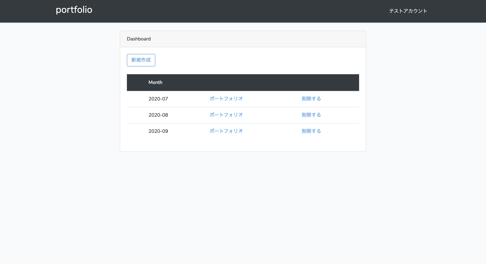
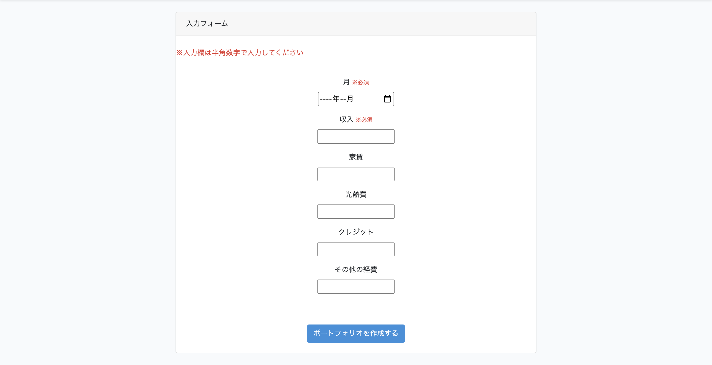

## アプリ名
- portforio (お金の管理ポートフォリオ)

 

## 概要 
- 内容 
１ヶ月のお金の管理ができるシステムを開発しました。 
収入と支出を入力することで、１ヶ月の自由に使える金額と貯金金額を割合に基づいて自動で計算し、ポートフォリオを作成します。 
○固定の支出：自由に使える金額：貯金金額 = 5:3:2 に近くなるようにプログラミングしています。 
固定の支出の入力により比率は変わってきます。 
 

- 機能
○ユーザー登録  ○ログインログアウト  ○金額の入力、保存  
○プログラムによる計算  ○１ヶ月のポートフォリオ作成  ○編集機能　○削除機能  
 

## 本番環境

- URL： https://safe-mesa-02613.herokuapp.com/
- テストアカウント  

ID (Email)： test@test.com 
password： pass1122 
 

 

## 作成背景
将来に向けて、お金の管理を見えるかして計画的に運用していく為に作成しました。 
１ヶ月が終わり振り返ると計画と支出の誤差があるという人が多く、 
そのようなことがないように計画をしっかりと立てることができ、尚且つ簡単に管理ができる物を作成したいと思いました。 
貯金はしたいが、なかなかできないという人に活用してもらえるようなアプリになっています。 
 
 

## 開発環境
- HTML
- Bootstrap
- PHP/ Laravel
- MySQL
- Github
- heroku
- Visual Studio Code
 

## 工夫ポイント

- 入力を元に自動で計算ができ、ポートフォリオを作成できるように実装した。
- Bootstrapを活用し、レイアウトをシンプルで見やすくした。また棒グラフでわかりやすくした。
 

## 今後実装したい機能
- 結果を入力して比較できるシステムを追加したい
 

## データベース設計
 

## categoryテーブル

|Column|Type|Options|
|------|----|-------|
|income|integer|reqired|
|rent|integer|nullable|
|utility|integer|nullable|
|credit|integer|nullable|
|etc|integer|nullable|
|month|text|reqired|
|user_id|unsignedBigIntege|reqired|

### Association
- bilongsTo('App\user')

## userテーブル

|Column|Type|Options|
|------|----|-------|
|name|string|
|email|string|unique|
|password|string|
|created_at|
|update_at|

### Association
- has_many :categories

 
 

## APPイメージ画像
 

 

 

